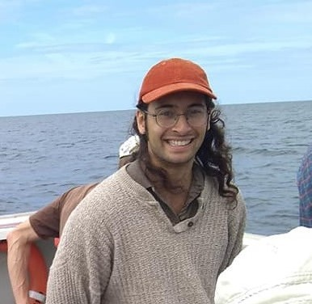

	

		

		

	

	

		

		<a href="https://engineering.jhu.edu/ams/">Department of Applied Mathematics and Statistics</a> 
		<a href="https://engineering.jhu.edu/">Whiting School of Engineering</a> 
          	<a href="https://www.jhu.edu/">Johns Hopkins University</a> 
		 
		<a href="{{ BASE_PATH }}/assets/JoshuaAgterbergCV.pdf">CV</a> 
		<a href = "https://github.com/jagterberg">github</a> 
		<a href = "https://www.linkedin.com/in/joshuaagterberg/">LinkedIn</a> 
		
		
	

 
 

Hello! I am a graduate student at Johns Hopkins working on my master's in applied mathematics and statistics. 
I am broadly interested in computational statistics.  Recently, I have become interested in algorithms and 
statistical models for networks thanks to [Carey Priebe](https://www.ams.jhu.edu/~priebe/) and his graduate 
Statistical Theory class. I am hoping to work in this area during my PhD in Statistics.  

I graduated from the University of Wisconsin-Madison in 2017 with my Bachelor of Business Administration in actuarial
science and mathematics.  While there, I was fortunate to be advised by [Margie Rosenberg](https://bus.wisc.edu/faculty/marjorie-rosenberg).
During my senior year, I started some research examining the possibilities of unsupervised learning for insurance data.
As of now, we are finishing up a [project](https://www.soa.org/pd/events/2017/predictive-analytics-symposium/pd-2017-09-predictive-analytics-session-010.pdf) 
involving the use of k-medoids clustering on survey data when variables are all categorical.  

This work has led me to develop my [catDist](https://github.com/jagterberg/catDist) R package for dissimilarity
indices when data are all or almost all categorical. Although the package is still in development, it may still
be useful for practitioners interested in k-medoids or spectral methods. My hope is that the package will be able 
to provide more context-specific dissimilarity metrics than [Gower's distance](https://www.r-bloggers.com/clustering-mixed-data-types-in-r/),
which is what is typically used within the unsupervised learning community.

Finally, in my spare time, I like to read good fantasy and play jazz piano.  In Madison, I regularly played piano with 
[The Left Field Quartet](https://leftfieldquartet.bandcamp.com/releases).  

