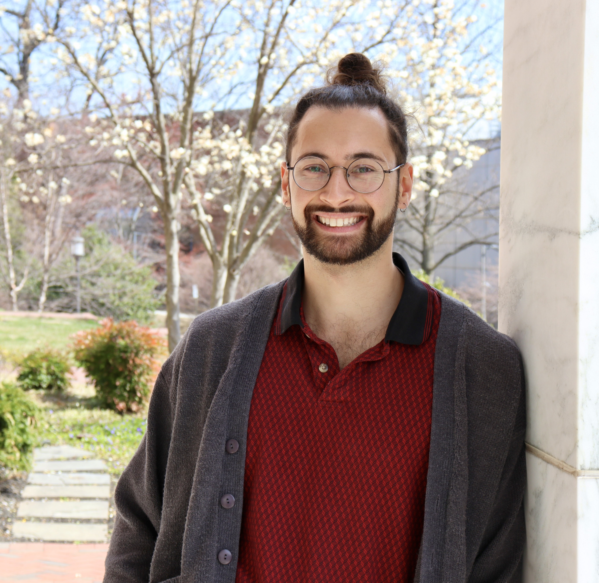

	

		

		

	

	

		

		<a href="https://stat.illinois.edu/">Department of Statistics</a> 
		<a href="https://illinois.edu/">University of Illinois Urbana-Champaign</a> 
		 
		<a href="{{ BASE_PATH }}/assets/JoshuaAgterbergCV.pdf">CV</a> 
		<a href = "https://github.com/jagterberg">github</a> 
		<a href = "https://www.linkedin.com/in/joshuaagterberg/">LinkedIn</a> 
		
		
	

 
 

I am an assistant professor in the [Department of Statistics](https://stat.illinois.edu/) at the [University of Illinois Urbana-Champaign](https://illinois.edu/). I am broadly interested in the analysis of algorithms and statistical models for networks and structured matrix and tensor data. 

Some ways to get to know about me and my research can be found [here](https://engineering.jhu.edu/ams/news/agterberg-analyzes-multilayer-networks-from-airports-to-hogwarts/) or [here](https://stat.illinois.edu/news/2024-12-02t162220/faculty-profile-getting-know-joshua-agterberg).  I am also a member of [Math Alliance](https://www.mathalliance.org/).

Due to the large volume of emails I receive, I am unable to respond to inquiries from prospective PhD students.  PhD admissions are centralized at UIUC, so if you are interested in doing research with me, please apply directly to the PhD program in Statistics.  If you are already at UIUC, please read [this](/pages/phd_students.html).

Previously, I spent one year as a postdoctoral researcher at the [University of Pennsylvania](https://www.upenn.edu/) working with [René Vidal](http://vision.jhu.edu/rvidal.html) and [Yuxin Chen](https://yuxinchen2020.github.io/index.html). I defended my PhD in applied mathematics and statistics from Johns Hopkins in February 2023, and my dissertation can be found "[here](/assets/dissertation.pdf)." My advisor ws Professor [Carey Priebe](https://www.ams.jhu.edu/~priebe/).  I graduated from the University of Wisconsin-Madison in 2017 with my Bachelor of Business Administration in actuarial
science and mathematics.  While there, I was fortunate to be advised by [Margie Rosenberg](https://bus.wisc.edu/faculty/marjorie-rosenberg).  

In my free time I enjoy trail running and lifting weights.  Ask me to run with you if you see me at a conference!
